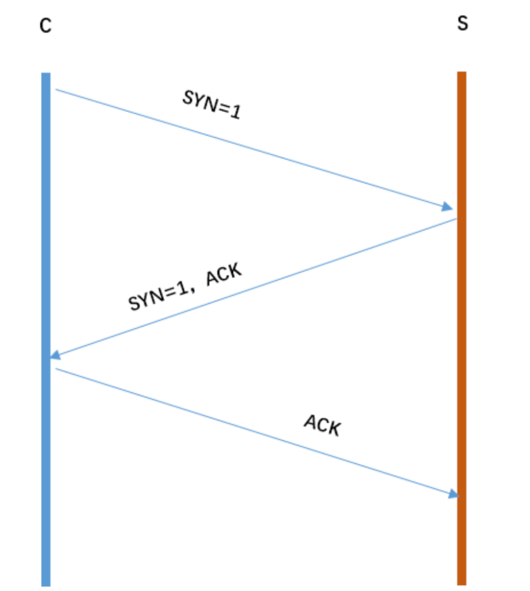

## 1. 说一下 http 和 https

https 的 **SSL 加密是在传输层实现的**

### 1.1 基本概念

1. http:超文本传输协议，是互联网上应用最为广泛的一种网络协议，是一个客户端和服 务器端请求和应答的标准（TCP）;用于从 WWW 服务器传输超文本到本地浏览器的传 输协议，它可以使浏览器更加高效，使网络传输减少
2. https: 是以安全为目标的 HTTP 通道，简单讲是 HTTP 的安全版, 需要借助与SSL进行加密; https 协议的主要作用是：建立一个信息安全通道，来确保数组的传输，确保网站的真实性。

### 1.2 http和https的区别

1. Https 协议需要 ca 证书，费用较高
2. http使用明文传输,https使用具有安全性的ssl加密传输协议
3. http一般使用80端口, https端口为443
4. http是无状态连接; https协议是由SSL+HTTP协议构建的可进行加密创术,身份认证的网络协议, 比http更安全

### 1.3 https 协议的工作原理

- 客户使用 https url 访问服务器，则要求 web 服务器建立 ssl 链接
- web 服务器接收到客户端的请求之后，会将网站的证书（证书中包含了公钥），返回或 者说传输给客户端
- 客户端和 web 服务器端开始协商 SSL 链接的安全等级，也就是加密等级
- 客户端浏览器通过双方协商一致的安全等级，建立会话密钥，然后通过网站的公钥来加 密会话密钥，并传送给网站
- web 服务器通过自己的私钥解密出会话密钥
- web 服务器通过会话密钥加密与客户端之间的通信

### 1.4 https 协议的优点

1. 要比 http 协议安全，可防止数据在传输过程中不被窃取、改变，确保数据的完整性

### 1.5 https 协议的缺点

1. https 握手阶段比较费时，会使页面加载时间延长 50%
2. https 缓存不如 http 高效，会增加数据开销
3. SSL 证书也需要钱，功能越强大的证书费用越高
4. SSL 证书需要绑定 IP，不能再同一个 ip 上绑定多个域名，ipv4 资源支持不了这种消耗

## 2. tcp 三次握手过程



1. 第一次握手：S 只可以确认 自己可以接受 C 发送的报文段
2. C 可以确认 S 收到了自己发送的报文段，并且可以确认 自己可以接受 S 发 送的报文段
3. 第三次握手：S 可以确认 C 收到了自己发送的报文段

## 3. TCP 和 UDP 的区别

1. TCP 是面向连接的，udp 是无连接的
2. TCP 提供可靠的服务, 即TCP要确保数据的无差错,无丢失,无重复; ;UDP 尽最大努力交付，即不保证可靠交付
3. TCP 是面向字节流，UDP 面向报文
4. TCP 只能是 1 对 1 的，UDP 支持 1 对 1,1 对多
5. TCP 的首部较大为 20 字节，而 UDP 只有 8 字节

## 4. WebSocket 的实现和应用

### 4.1 什么是 WebSocket

1. WebSocket 是 HTML5 中的协议，支持持久连续

### 4.2 WebSocket 是什么样的协议，具体有什么优点

1. WebSocket是HTML5中的协议，支持持久连接；而Http协议不支持持久连接;
2. HTTP中永远是这样，也就是说一个request只能有一个response。而且这个response也是被动的，不能主动发起。
3. 由于Websocket只需要一次HTTP握手，所以说整个通讯过程是建立在一次连接/状态中，也就避免了HTTP的非状态性，服务端会一直知道你的信息，直到你关闭请求，这样就解决了接线员要反复解析HTTP协议，还要查看identity
   info的信息

### 4.3 Websocket的作用

1. ajax轮询: 浏览器隔个几秒就发送一次请求，询问服务器是否有新信息。
2. long poll（长轮询）
3. 当服务器完成协议升级后（HTTP->Websocket），服务端就可以主动推送信息给客户端啦。解决了上面同步有延迟的问题

## 5. 一个图片url访问后直接下载怎样实现

- 请求的返回头里面，用于浏览器解析的重要参数就是 OSS 的 API 文档里面的返回 http 头，决定用户下载行为的参数

```
下载的情况下： 
1. x-oss-object-type: Normal 
2. x-oss-request-id: 598D5ED34F29D01FE2925F41 
3. x-oss-storage-class: Standard
```

## 6. 说一下 web Quality（无障碍）

- 能够被残障人士使用的网站
- 使用 alt 属性：``

## 7. 几个很实用的 BOM 属性对象方法

> 什么是 Bom? Bom 是浏览器对象

### 7.1 location 对象

```js
location.href //返回或设置当前文档的 URL 
location.search //返回 URL 中的查询字符串部分
location.hash //返回 URL#后面的内容，如果没有#，返回空
location.host //返回 URL 中的域名部分
location.hostname // URL中的主域名
location.pathname // 返回URL域名后的部分
location.port //分会URL中的端口号
location.protocol //返回URL中的协议部分
location.assign('url') //设置当前文档的URl
location.replace() //设置当前文档的 URL，并且在 history 对象的地址列表中移除这个 URL
location.reload() //重载当前页面
```

### 7.2 history对象

```js
history.go() //前进或后退指定的页面数
history.go(num);
istory.back() //后退一页 
history.forward() //前进一页
```

### 7.3 Navigator 对象

```js
navigator.userAgent //返回用户代理头的字符串表示(就是包括浏览器版本信息等的字 符串)
navigator.cookieEnabled //判断浏览器是否启用cookie
```

## 8. 说一下 HTML5 drag api

```
dragstart：事件主体是被拖放元素，在开始拖放被拖放元素时触发，
darg：事件主体是被拖放元素，在正在拖放被拖放元素时触发。 
dragenter：事件主体是目标元素，在被拖放元素进入某元素时触发。 
dragover：事件主体是目标元素，在被拖放在某元素内移动时触发
dragleave：事件主体是目标元素，在被拖放元素移出目标元素是触发
drop：事件主体是目标元素，在目标元素完全接受被拖放元素时触发。
dragend：事件主体是被拖放元素，在整个拖放操作结束时触发
```

## 9. 说一下 http2.0

1. http2.0 是基于 1999 年发布的 http1.0 之后的首次更新
2. 特点:
    - 提升访问速度
    - 允许多路复用,允许同时通过单一的 HTTP/2 连接发送多重请求-响应信息
    - 二进制分帧;
    - 首部压缩
    - 服务端推送

## 10. 400 和 401、403 状态码

- 400: 请求无效
    - 原因: 前端提交数据的字段名称和字段类型与后台的实体没有保持一致
    - 前端提交到后台的数据应该是 json 字符串类型，但是前端没有将对象 JSON.stringify 转 化成字符串
    - 解决:
        1. 对照字段的名称，保持一致性
        2. 将 obj 对象通过 JSON.stringify 实现序列化

- 401: 当前请求需要用户验证
- 403: 服务器已经得到请求，但是拒绝执行

## 11. fetch 发送 2 次请求的原因

1. 因为你用 fetch 的 post 请求的时候，导致 fetch 第一次发送了一个 Options 请求，询问服务器是否支持修改的请求头，如果服务器支持，则在第二次中发送真正的 请求。

## 12. Cookie、sessionStorage、localStorage 的区别

### 12.1 共同点

1. 都是保存在浏览器端，并且是同源的

### 12.2 不同点

1. cookie 数据始终在同源的 http 请求中携带（即使不需要），即 cookie 在浏览器 和服务器间来回传递。而 sessionStorage 和 localStorage 不会自动把数据发给服务器，仅 在本地保存。cookie
   数据还有路径（path）的概念，可以限制 cookie 只属于某个路径下, 存储的大小很小只有 4K 左右。 （key：可以在浏览器和服务器端来回传递，存储容量 小，只有大约 4K 左右）;
2. sessionStorage：仅在当前浏览器窗口关闭前有效，自然也就不可能持久保持，localStorage： 始终有效，窗口或浏览器关闭也一直保存，因此用作持久数据；cookie 只在设置的 cookie
   过期时间之前一直有效，即使窗口或浏览器关闭。（key：本身就是一个回话过程，关 闭浏览器后消失，session 为一个会话，当页面不同即使是同一页面打开两次，也被视为 同一次会话）
3. localStorage：localStorage 在所有同源窗口中都是共享的；cookie 也是在所有同源窗口中 都是共享的。（key：同源窗口都会共享，并且不会失效，不管窗口或者浏览器关闭与 否都会始终生效）

### 12.3 cookie的作用

1. 保存用户登录状态
2. 可以设置过期时间
3. 跟踪用户行为

## 13. 说一下 web worker

1. 在 HTML 页面中，如果在执行脚本时，页面的状态是不可响应的，直到脚本执行完成后， 页面才变成可响应
2. **web worker 是运行在后台的 js**，独立于其他脚本，不会影响页面的性能
3. 并且通过 postMessage 将结果回传到主线程。这样在进行复杂操作的时候，就 不会阻塞主线程了

### 13.1 如何创建 web worker?

- 检测浏览器对于 web worker 的支持性
- 创建 web worker 文件（js，回传函数等）
- 创建 web worker 对象

## 14. 对 HTML 语义化标签的理解

- HTML5 语义化标签是指**正确的标签包含了正确的内容**，结构良好，便于阅读
- nav article header aside footer

## 15. iframe 是什么？有什么缺点

### 15.1 理解iframe

- iframe 元素会创建包含另一个文档的内联框架;
- 可以将提示文字放在<iframe></iframe>之间，来提示某些不支持 iframe 的浏览器

### 15.2 iframe的缺点

1. 会阻塞主页面的 onload 事件
2. 搜索引擎无法解读这种页面，不利于 SEO
3. iframe 和主页面共享连接池，而浏览器对相同区域有限制所以会影响性能。

## 16. Doctype 作用?严格模式与混杂模式如何区分？它们有何意义?

- Doctype 声明于文档最前面，告诉浏览器以何种方式来渲染页面，这里有两种模式，**严格模式和混杂模式**
    - 严格模式的排版和 JS 运作模式是 以该浏览器支持的最高标准运行
    - 混杂模式，向后兼容，模拟老式浏览器，防止浏览器无法兼容页面

## 17. Cookie 如何防范 XSS 攻击

1. XSS（跨站脚本攻击）是指攻击者在返回的 HTML 中嵌入 javascript 脚本
2. 需要在 HTTP 头部配上，`set-cookie：httponly`, 这个属性可以防止 XSS,它会禁止 javascript 脚本来访问 cookie
3. `secure`  这个属性告诉浏览器仅在请求为 https 的时候发送 cookie

## 18. Cookie 和 session 的区别

- 因此 Cookie 的最大的作用就是存储 sessionId 用来唯一标识用户

## 19. click 在 ios 上有 300ms 延迟，原因及如何解决

- 原因: 移动端的双击会缩放导致click判断延迟

1. 禁用缩放 `<meta name="viewport" content="width=device-width, user-scalable=no">`
2. 利用 FastClick: 检测到 touchend 事件后，立刻出发模拟 click 事件，并且把浏览器 300 毫秒之后真正出 发的事件给阻断掉

```js
<script src="./js/fastclick.js"></script>
<script>
    window.addEventListener( "load", function() {
    FastClick.attach(document.body)
}, false );
</script>
```

## 20. cookie和session 区别

1. cookie 数据存放在客户的浏览器上，session 数据放在服务器上
2. cookie 不是很安全，别人可以分析存放在本地的 COOKIE 并进行 COOKIE 欺骗 考虑到安全应当使用 session
3. session 会在一定时间内保存在服务器上。当访问增多，会比较占用你服务器的性能 考虑到减轻服务器性能方面，应当使用 COOKIE
4. 单个 cookie 保存的数据不能超过 4K，很多浏览器都限制一个站点最多保存 20 个 cookie

## 21. 常见http 返回的状态码

```
100 Continue 继续。客户端应继续其请求 
101 Switching Protocols 切换协议。服务器根据客户端的请求切换协议。只能切换到更 高级的协议，例如，切换到 HTTP 的新版本协议 
200 OK 请求成功。一般用于 GET 与 POST 请求 
201 Created 已创建。成功请求并创建了新的资源 
202 Accepted 已接受。已经接受请求，但未处理完成 
203 Non-Authoritative Information 非授权信息。请求成功。但返回的 meta 信息不在原 始的服务器，而是一个副本 
204 No Content 无内容。服务器成功处理，但未返回内容。在未更新网页的情况下， 可确保浏览器继续显示当前文档
205 Reset Content 重置内容。服务器处理成功，用户终端（例如：浏览器）应重置文 档视图。可通过此返回码清除浏览器的表单域 
206 Partial Content 部分内容。服务器成功处理了部分 GET 请求
300 Multiple Choices 多种选择。请求的资源可包括多个位置，相应可返回一个资源特 征与地址的列表用于用户终端（例如：浏览器）选择 
301 Moved Permanently 永久移动。请求的资源已被永久的移动到新 URI，返回信息会 包括新的 URI，浏览器会自动定向到新 URI。今后任何新的请求都应使用新的 URI 代替 
302 Found 临时移动。与 301 类似。但资源只是临时被移动。客户端应继续使用原有 URI 
303 See Other 查看其它地址。与 301 类似。使用 GET 和 POST 请求查看 
304 Not Modified 未修改。所请求的资源未修改，服务器返回此状态码时，不会返回 任何资源。客户端通常会缓存访问过的资源，通过提供一个头信息指出客户端希望只返 回在指定日期之后修改的资源 
305 Use Proxy 使用代理。所请求的资源必须通过代理访问 
306 Unused 已经被废弃的 HTTP 状态码 
307 Temporary Redirect 临时重定向。与 302 类似。使用 GET 请求重定向 
400 Bad Request 客户端请求的语法错误，服务器无法理解 
 401 Unauthorized 请求要求用户的身份认证 
 402 Payment Required 保留，将来使用 
 403 Forbidden 服务器理解请求客户端的请求，但是拒绝执行此请求
 404 Not Found 服务器无法根据客户端的请求找到资源（网页）。通过此代码，网站 设计人员可设置"您所请求的资源无法找到"的个性页面 
 405 Method Not Allowed 客户端请求中的方法被禁止
 406 Not Acceptable 服务器无法根据客户端请求的内容特性完成请求
 407 Proxy Authentication Required 请求要求代理的身份认证，与 401 类似，但请求者 应当使用代理进行授权 
 408 Request Time-out 服务器等待客户端发送的请求时间过长，超时 
 409 Conflict 服务器完成客户端的 PUT 请求是可能返回此代码，服务器处理请求时发 生了冲突 410 Gone 客户端请求的资源已经不存在。
 410 不同于 404，如果资源以前有现在被永 久删除了可使用 410 代码，网站设计人员可通过 301 代码指定资源的新位置 
 411 Length Required 服务器无法处理客户端发送的不带 Content-Length 的请求信息 
 412 Precondition Failed 客户端请求信息的先决条件错误 
 413 Request Entity Too Large 由于请求的实体过大，服务器无法处理，因此拒绝请求。 为防止客户端的连续请求，服务器可能会关闭连接。如果只是服务器暂时无法处理，则 会包含一个 Retry-After 的响应信息 
 414 Request-URI Too Large 请求的 URI 过长（URI 通常为网址），服务器无法处理 
 415 Unsupported Media Type 服务器无法处理请求附带的媒体格式 
 416 Requested range not satisfiable 客户端请求的范围无效 
 417 Expectation Failed 服务器无法满足 Expect 的请求头信息 
 500 Internal Server Error 服务器内部错误，无法完成请求 
 501 Not Implemented 服务器不支持请求的功能，无法完成请求 
 502 Bad Gateway 作为网关或者代理工作的服务器尝试执行请求时，从远程服务器接 收到了一个无效的响
 503 Service Unavailable 由于超载或系统维护，服务器暂时的无法处理客户端的请求。 延时的长度可包含在服务器的 Retry-After 头信息中 
 504 Gateway Time-out 充当网关或代理的服务器，未及时从远端服务器获取请求
 505 HTTP Version not supported 服务器不支持请求的 HTTP 协议的版本，无法完成处理
```

## 22. http 常用请求头

- Accept: 可接受的响应内容类型（Content-Types）
- Accept-Charset: 可接受的字符集
- Accept-Encoding: 可接受的相应内容的编码方式
- Accept-Language: 可接受的相应语言列表
- Accept-Datetime: 可接受的按照时间来表示的响应内容版本
- Authorization: 用于表示 HTTP 协议中需要认证资源的认证信息
- Cache-Control: 用来指定当前的请求/回复中的，是否使用缓存机制
- Connection: 客户端（浏览器）想要优先使用的连接类型
- Cookie: 由之前服务器通过Set-Cookie（见下文）设置的一个HTTP协议Cookie
- Content-Length: 以 8 进制表示的请求体的长度
- Content-MD5: 请求体的内容的二进制 MD5 散列值（数字签名），以 Base64 编 码的结果
- Content-Type: 请求体的 MIME 类型 （用于 POST 和 PUT 请求中）
- Date: 发送该消息的日期和时间（以 RFC 7231 中定义的"HTTP 日期"格式 来发送）
- Expect: 表示客户端要求服务器做出特定的行为
- From: 发起此请求的用户的邮件地址
- Host: 表示服务器的域名以及服务器所监听的端口号。如果所请求的端口 是对应的服务的标准端口（80），则端口号可以省略。
- If-Match: 仅当客户端提供的实体与服务器上对应的实体相匹配时，才进行对 应的操作。主要用于像 PUT 这样的方法中，仅当从用户上次更新 某个资源后，该资源未被修改的情况下，才更新该资源;
- If-Modified-Since: 允许在对应的资源未被修改的情况下返回 304 未修改
- If-None-Match: 允许在对应的内容未被修改的情况下返回 304 未修改（ 304 Not Modified ），参考 超文本传输协议 的实体标记
- If-Range: 如果该实体未被修改过，则向返回所缺少的那一个或多个部分。否则，返回整个新的实体
- If-Unmodified-Since: 仅当该实体自某个特定时间以来未被修改的情况下，才发送回应。
- Max-Forwards: 限制该消息可被代理及网关转发的次数
- Origin: 发起一个针对跨域资源共享的请求（该请求要求服务器在响应中加 入一个 Access-Control-Allow-Origin 的消息头，表示访问控制所允许 的来源）。
- Pragma: 与具体的实现相关，这些字段可能在请求/回应链中的任何时候产 生。
- roxy-Authorization: 用于向代理进行认证的认证信息。
- Range: 表示请求某个实体的一部分，字节偏移以 0 开始
- Referer:  表示浏览器所访问的前一个页面，可以认为是之前访问页面的链接 将浏览器带到了当前页面。Referer 其实是 Referrer 这个单词，但 RFC 制作标准时给拼错了，后来也就将错就错使用 Referer 了。
- TE: 浏览器预期接受的传输时的编码方式：可使用回应协议头 Transfer-Encoding 中的值（还可以使用"trailers"表示数据传输时的分 块方式）用来表示浏览器希望在最后一个大小为 0 的块之后还接收 到一些额外的字段。
- User-Agent: 浏览器的身份标识字符串;
- Upgrade: 要求服务器升级到一个高版本协议
- Via :告诉服务器，这个请求是由哪些代理发出的。
- Warning: 一个一般性的警告，表示在实体内容体中可能存在错误

## 23. 前端优化

1. 降低请求量：合并资源，减少 HTTP 请求数，minify / gzip 压缩，webP，lazyLoad
2. 加快请求速度：预解析 DNS，减少域名数，并行加载，CDN 分发。
3. 缓存：HTTP 协议缓存请求，离线缓存 manifest，离线数据缓存 localStorage。
4. 渲染：JS/CSS 优化，加载顺序，服务端渲染，pipeline

## 24. GET 和 POST 的区别

1. get 参数通过 url 传递，post 放在 request body 中
2. get 请求在 url 中传递的参数是有长度限制的(IE:2083字节,Firefox:65536, Safari:80000,Opera:190000,Google:8182,)，而 post 没有。

> 对于中文的传递，最终会为urlencode后的编码形式进行传递，如果浏览器的编码为UTF8的话，一个汉字最终编码后的字符长度为9个字符

3. get 比 post 更不安全，因为参数直接暴露在 url 中，所以不能用来传递敏感信息。
4. get 请求只能进行 url 编码，而 post 支持多种编码方式;
5. get 请求会浏览器主动 cache
6. get 请求参数会被完整保留在浏览历史记录里，而 post 中的参数不会被保留
7. GET 产生一个 TCP 数据包；POST 产生两个 TCP 数据包

## 25. HTTP 支持的方法

- get
- post
- put
- delete
- head
- options
- trace
- connect

## 26. 如何画一个三角形

> 原理: 边框的均分

```css
div {
    width: 0;
    height: 0;
    border-top: 10px solid red;
    border-right: 10px solid transparent;
    border-bottom: 10px solid transparent;
    border-left: 10px solid transparent;
}
```

## 27. 说一下浏览器缓存

### 27.1 强缓存

- expires
- cache-control
- 两者同时存在, cache-control的优先级高于expires

### 27.2 协商缓存

- Last-Modified/If-Modified-Since
- ETag/If-None-Match

## 28. HTML5 新增的元素

1. 增加了 header，footer，nav,aside,section 等语义 化标签
2. 表单方面，为了增强表单，为 input 增加了 color，email,data ,range 等类型
3. 在存储方面，提供了 sessionStorage，localStorage,和离线存储
4. 多媒体方面规定了音频和视频元素 audio 和 video，另外还 有地理定位，canvas 画布，拖放，多线程编程的 web worker 和 websocket 协议

## 29. 在地址栏里输入一个 URL,到这个页面呈现出来，中间会发生什么

1. 输入 url 后，首先需要找到这个 url 域名的服务器 ip,为了寻找这个 ip，浏览器首先会寻 找缓存，查看缓存中是否有记录，缓存的查找记录为：浏览器缓存-> 系统缓存-> 路由器缓存->DNS跟服务器
2. 得到服务器的 ip 地址后，浏览器根据这个 ip 以及相应的端口号，构造一个 http 请 求，这个请求报文会包括这次请求的信息，主要是请求方法，请求说明和请求附带的数据，并将这个 http 请求封装在一个 tcp 包中，这个 tcp
   包会依次经过传输层，网络层， 数据链路层，物理层到达服务器
3. 服务器解析这个请求来作出响应, 返回相应的html
4. 浏览器构建DOM树, 若过程中遇到js脚本或者外部js连接,则会停止构建DOM树下载对应的代码;
5. 根据外部样式,内部样式, 内联样式构建css对象模型的CSSOM树,并和DOM树合并为渲染树;
6. 渲染页面,遇到其他资源是会并行下载

## 30. cache-control 的值有哪些

> cache-control 是一个通用消息头字段被用于 HTTP 请求和响应中，通过指定指令来实现 缓存机制，这个缓存指令是单向的

### 常见的取值:

- private(默认)
- no-cache
- max-age
- must-revalidate

## 31. 浏览器在生成页面的时候，会生成那两颗树

- Dom树和CSSOM规则树
- 当浏览器接收到服务器相应来的 HTML 文档后，会遍历文档节点，生成 DOM 树， CSSOM 规则树由浏览器解析 CSS 文件生成

## 32.csrf 和 xss 的网络攻击及防范

### 32.1 CSRF (跨站请求伪造)

- 可以理解为攻击者盗用了用户的身份，以用户的名义发送了恶意请求;
- 比如用户登录了一个网站后，立刻在另一个ｔａｂ页面访问攻击者用来制造攻击的网站，这个网站要求访问刚刚登陆的网站，并发送了一个恶意请求，这时候 CSRF 就产生了，比如这个制造攻击的网站使用一张图片，但是这种图片的链接却是可以修改
  数据库的，这时候攻击者就可以以用户的名义操作这个数据库，防御方式的话：使用验证码，检查 https 头部的 refer，使用 token;

### 32.2 XSS(跨站脚本攻击)

- 攻击者通过注入恶意的脚本，在用户浏览网页的时候进行攻击;
- 防御的话为 cookie 设置 httpOnly 属性，对用户的输入进行检查，进行特殊字符过滤

## 33. 怎么看网站的性能如何

- 一种是被动去测：就是在被检测的页面置入脚本或探针，当用户访问网页时，探针自动采集数据并传回数据库进行分析
- 另一种主动监测的方式，即主动的搭建分布式受控环境，模拟用户发起页面访问请求，主动采集性能数 据并分析，在检测的精准度上，专业的第三方工具效果更佳，比如说性能极客。

## 34. cookie 有哪些字段可以设置

- name 字段为一个 cookie 的名称
- value 字段为一个 cookie 的值
- domain 字段为可以访问此 cookie 的域名
- path 字段为可以访问此 cookie 的页面路径
- expires/Max-Age 字段为此 cookie 超时时间
- Size 字段 此 cookie 大小
- http字段 cookie的httponly属性。若此属性为true，则只有在http请求头中会带有此cookie 的信息，而不能通过 document.cookie 来访问此 cookie
- secure 字段 设置是否只能通过 https 来传递此条 cookie

## 35. cookie 有哪些编码方式

- encodeURI()

## 36. 除了 cookie，还有什么存储方式

- localStorage，sessionStorage，indexdDB 等

## 37. HTML5 和 CSS3 用的多吗？你了解它们的新属性吗？有在项目中用过 吗

### 37.1 HTML5

1. 8 个语义元素 header section footer aside nav main article figure
2. 内容元素 mark 高亮 progress 进度
3. 新的表单控件 calendar date time email url search
4. 新的 input 类型 color date datetime datetime-local email
5. 移除过时标签 big font frame frameset
6. canvas 绘图，支持内联 SVG。支持 MathML
7. 多媒体 audio video source embed track
8. 本地离线存储，把需要离线存储在本地的文件列在一个 manifest 配置文件
9. web 存储。localStorage、SessionStorage

### 37.2 CSS3

1. CSS3边框如border-radius，box-shadow等
2. CSS3背景如background-size，background-origin
3. CSS3 2D，3D 转换如 transform 等
4. CSS3 动画如 animation 等;
5. CSS3文字效果: text-shadow,word-warp
6. CSS3用户界面: resize,box-sizing, outline-offset
7. 多列: column-count,column-gap,column-rule

## 38. HTML的离线存储怎么使用?

1. 创建一个和html同名的manifest文件, 然后在页面头部下面加入一个manifest属性: `<html lang='en' manifest = "index.manifest">`
2. 在如下cache.manifest文件中变谢谢离线存储的资源:

```
CACHE MANIFEST #0.11
CACHE:js/app.js css/style.css NETWORK:resourse/logo.png FALLBACK://offline.html
```

- CACHE:表示需要离线存储的资源列表，由于包含manifest文件的页面将被自动离线存储，所以不需要把页面自身也列出来。
- NETWORK:
  表示在它下面列出来的资源只有在在线的情况下才能访问，他们不会被离线存储，所以在离线情况下无法使用这些资源。不过，如果在CACHE和NETWORK中有一个相同的资源，那么这个资源还是会被离线存储，也就是说CACHE的优先级更高。
- FALLBACK:表示如果访问第一个资源失败，那么就使用第二个资源来替换他，比如上面这个文件表示的就是如果访问根目录下任何一个资源失败了，那么就去访问offline.html 。
- 离线状态时: 操作`window.applicationCache`进行离线缓存的操作
