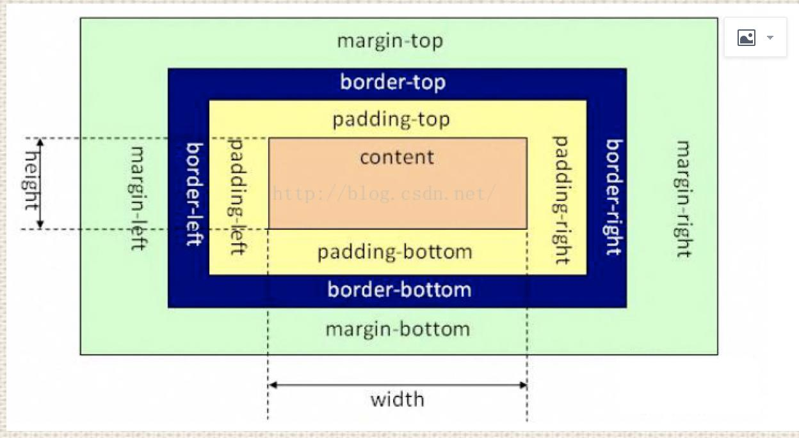
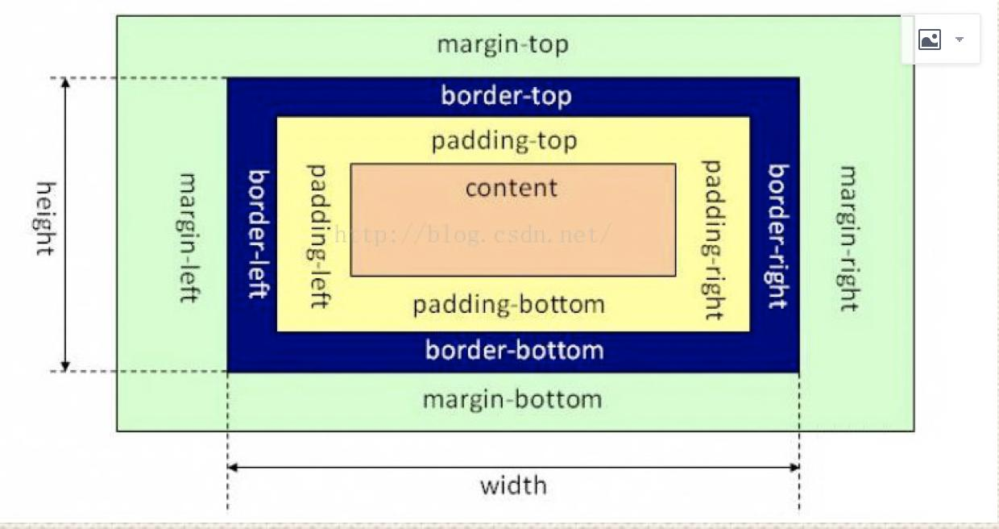

## 1. 说一下 css 盒模型

1. 就是用来装页面上的元素的矩形区域。CSS 中的盒子模型包括 `IE盒子模型`和标准的 `W3C 盒子模型`
2. box-sizing: border-box,padding-box,content-box

### 1.1 标准盒子模型



### 1.2 IE 盒子模型



- 在 标准的盒子模型中，width 指 content 部分的宽度，在 IE 盒子模型中，width 表示 content+padding+border 这三个部分的宽度
- 标准盒子模型的盒子宽度：左右 border+左右 padding+width
- box-sizing:border-box 表示的是 IE 盒子模型

## 2. 画一条0.5px的线

1. 采用meta viewport的方式

```html

<meta name="viewport" content="initial-scale=1.0, maximum-scale=1.0, user-scalable=no"/>
```

2. 采用border-image的方式
3. 采用transform:scale()的方式

```css
 .line {
    width: 100px;
    height: 1px;
    transform: scale(1, 0.5);
    background-color: red;
}
```

## 3. link 标签和 import 标签的区别

- link 属于 html 标签，而@import 是 css 提供的
- 页面被加载时，link 会同时被加载，而@import 引用的 css 会等到页面加载结束后加载。
- link 是 html 标签，因此没有兼容性，而@import 只有 IE5 以上才能识别。
- link 方式样式的权重高于@import 的

## 3. transition 和 animation 的区别

1. Animation 和 transition 大部分属性是相同的，他们都是随时间改变元素的属性值
2. 主要区别是 **transition 需要触发一个事件才能改变属性，而 animation不需要触发任何事件的情况下才会随时间改变属性值**
3. transition 为 2 帧，从 from .... to，而 animation 可以一帧一帧的

## 4. 对Flex 布局的认识

1. Flex 是 Flexible Box 的缩写，意为"弹性布局"，用来为盒状模型提供最大的灵活性
2. 布局的传统解决方案，基于盒状模型，依赖 display 属性 + position 属性 + float 属性。它对于那些特殊布局非常不方便，比如，垂直居中就不容易实现;
3. 简单的分为`容器属性`和`元素属性`
    - 容器属性:
        1. flex-direction：决定主轴的方向（即子 item 的排列方法）
        2. flex-wrap：决定换行规则(nowrap | wrap | wrap-reverse;)
        3. flex-flow: <flex-direction> || <flex-wrap>;
        4. justify-content：对其方式，水平主轴对齐方式
        5. align-items：对齐方式，竖直轴线方向
    - 元素属性:
        1. order 属性：定义项目的排列顺序，顺序越小，排列越靠前，默认为 0
        2. flex-grow 属性：定义项目的放大比例，即使存在空间，也不会放大
        3. flex-shrink 属性：定义了项目的缩小比例，当空间不足的情况下会等比例的缩小，如果 定义个 item 的 flow-shrink 为 0，则为不缩小
        4. flex-basis 属性：定义了在分配多余的空间，项目占据的空间
        5. **flex：是 flex-grow 和 flex-shrink、flex-basis 的简写，默认值为 0 1 auto。**
        6. align-self：允许单个项目与其他项目不一样的对齐方式，可以覆盖 align-items，默认属 性为 auto，表示继承父元素的 align-items

## 5. 对BFC的理解

> BFC: 块级格式化上下文，是一个独立的渲染区域，并且有一定的布局规则

- BFC 区域不会与 float box 重叠
- BFC 是页面上的一个独立容器，子元素不会影响到外面
- 计算 BFC 的高度时，浮动元素也会参与计算

### 5.1 会生成BFC的元素

1. 根元素
2. float不为none的元素
3. position为fixed和absolute的元素
4. display 为 inline-block、table-cell、table-caption，flex，inline-flex 的元素
5. overflow 不为 visible 的元素

## 6. 垂直居中的方法

### 6.1 margin:auto法

> 定位为上下左右为 0，margin：0 可以实现脱离文档流的居中

```css
div {
    width: 400px;
    height: 400px;
    position: relative;
    border: 1px solid #465468;
}

img {
    position: absolute;
    margin: auto;
    top: 0;
    left: 0;
    right: 0;
    bottom: 0;
}
```

### 6.2 margin 负值法

```css
.container {
    width: 500px;
    height: 400px;
    border: 2px solid #379;
    position: relative;
}

.inner {
    width: 480px;
    height: 380px;
    background-color: #746;
    position: absolute;
    top: 50%;
    left: 50%;
    margin-top: -190px; /*height 的一半*/
    margin-left: -240px; /*width 的一半*/
}
```

### 6.3 table-cell（未脱离文档流的）

```css
div {
    width: 300px;
    height: 300px;
    border: 3px solid #555;
    display: table-cell;
    vertical-align: middle;
    text-align: center;
}

img {
    vertical-align: middle;
}
```

### 6.4 利用 flex

```css
.container {
    width: 300px;
    height: 200px;
    border: 3px solid #546461;
    display: -webkit-flex;
    display: flex;
    -webkit-align-items: center;
    align-items: center;
    -webkit-justify-content: center;
    justify-content: center;

}

.inner {
    border: 3px solid #458761;
    padding: 20px;
}
```

## 7. JS 动画和 css3 动画的区别

1. 渲染线程分为 main thread 和 compositor thread，如果 css 动画只改变 transform 和 opacity， 这时整个 CSS 动画得以在 compositor thread 完成;
2. 而 JS 动画则会在 main thread 执行，然后触发compositor thread 进行下一步操作;

### 7.1 区别

1. 功能涵盖面，JS 比 CSS 大
2. 实现/重构难度不一，CSS3 比 JS 更加简单，性能跳优方向固定
3. 对帧速表现不好的低版本浏览器，css3 可以做到自然降级
4. css 动画有天然事件支持
5. css3 有兼容性问题

## 8. 说一下块元素和行元素

1. 块元素：独占一行，并且自动填满父元素，可以设置 margin 和 padding 以及高度和宽度
2. 行元素：不会独占一行，width 和 height 会失效，并且在垂直方向的 padding 和 margin 会失

## 9. 多行元素的文本省略号

```css
text {
    white-space: nowrap;
/ / 文字在同一行显示 overflow: hidden;
/ / 内容溢出直接隐藏 text-overflow: ellipsis;
/ / 文本溢出省略号显示
}
```

## 10. visibility=hidden, opacity=0，display:none的区别

1. opacity=0，该元素隐藏起来了，但不会改变页面布局，并且，如果该元素已经绑定一些事件，如 click 事件，那么点击该区域，也能触发点击事件
2. visibility=hidden，该元素 隐藏起来了，但不会改变页面布局，但是不会触发该元素已经绑定的事件;
3. display=none， 把元素隐藏起来，并且会改变页面布局，可以理解成在页面中把该元素删除掉一样

## 11. 双边距重叠问题（外边距折叠）

- 多个相邻（兄弟或者父子关系）普通流的块元素垂直方向 marigin 会重叠
- 折叠的结果为:
    1. 两个相邻的外边距都是正数时，折叠结果是它们两者之间较大的值
    2. 两个相邻的外边距都是负数时，折叠结果是两者绝对值的较大值
    3. 两个外边距一正一负时，折叠结果是两者的相加的和

## 12. position属性比较

### 12.1 position:fixed

- 元素的位置相对于浏览器窗口是固定位置，即使窗口是滚动的它也不会移动
- Fixed 定 位使元素的位置与文档流无关，因此不占据空间
- Fixed 定位的元素和其他元素重叠

### 12.2 position:relative

- 如果对一个元素进行相对定位，它将出现在它所在的位置上。然后，可以通过设置垂直或水平位置，让这个元素“相对于”它的起点进行移动
- 在使用相对定位时，无论是否进行移动，元素仍然占据原来的空间。因此，移动元素会导致它覆盖其它框

### 12.3 position:absolute

- 绝对定位的元素的位置相对于最近的已定位父元素，如果元素没有已定位的父元素，那 么它的位置相对于<html>。
- absolute 定位使元素的位置与文档流无关，因此不占据空间。 absolute 定位的元素和其他元素重叠。

### 12.4 position: sticky

- 元素先按照普通文档流定位，然后相对于该元素在流中的 flow root（BFC）和 containing block（最近的块级祖先元素）定位。
- 而后，元素定位表现为在跨越特定阈值前为相对定位，之后为固定定位

### 12.5 默认定位 Static

- 默认值。没有定位，元素出现在正常的流中（忽略 top, bottom, left, right 或者 z-index 声 明）

### 12.6 inherit:

- 规定应该从父元素继承 position 属性的值。

## 13. 清除浮动

### 方法1: 使用带 clear 属性的空元素

- 在浮动元素后使用一个空元素如`<div class="clear"></div>`，并在 CSS 中赋 予.`clear{clear:both;}`属性即可清理浮动。亦可使用`<br class="clear" />`
  或`<hr class="clear" />` 来进行清理。

### 方法二：使用 CSS 的 overflow 属性

- 给浮动元素的容器添加 `overflow:hidden;`或 `overflow:auto;`可以清除浮动，另外在 IE6 中还 需要触发 hasLayout ，例如为父元素设置容器宽高或设置 zoom:1。
- 在添加 overflow 属性后，浮动元素又回到了容器层，把容器高度撑起，达到了清理浮动 的效果。

### 方法三：给浮动的元素的容器添加浮动

- 给浮动元素的容器也添加上浮动属性即可清除内部浮动，但是这样会使其整体浮动，影响布局，不推荐使用。

### 方法四：使用邻接元素处理

- 什么都不做，给浮动元素后面的元素添加 clear 属性。

### 方法五：使用 CSS 的:after 伪元素

- 结合:after 伪元素和 IEhack ，可以完美兼容当前主流的各大浏览器，这里的 IEhack 指的是触发 hasLayout
- 给浮动元素的容器添加一个 clearfix 的 class，然后给这个 class 添加一个:after 伪元素实 现元素末尾添加一个看不见的块元素（Block element）清理浮动

## 14. CSS 选择器有哪些，优先级是什么

### 14.1  CSS 选择器有哪些

> id 选择器，class 选择器，标签选择器，伪元素选择器，伪类选择器等

### 14.2 优先级

1. 同一元素引用了多个样式时，排在后面的样式属性的优先级高
2. 样式选择器的类型不同时，优先级顺序为：id 选择器 > class 选择器 > 标签选择器
3. 标签之间存在层级包含关系时，后代元素会继承祖先元素的样式。如果后代元素定义了 与祖先元素相同的样式，则祖先元素的相同的样式属性会被覆盖。继承的样式的优先级 比较低，至少比标签选择器的优先级低
4. 带有!important 标记的样式属性的优先级最高
5. 样式表的来源不同时，优先级顺序为：内联样式> 内部样式 > 外部样式 > 浏览器用户自定义样式 > 浏览器默认样式

### 15. css 动画如何实现

1. 创建动画序列，需要使用 animation 属性或其子属性，该属性允许配置动画时间、时长 以及其他动画细节
2. 由@keyframes规则定义动画的关键帧
3. transition 也可实现动画。transition 强调过渡，是元素的一个或多个属性发生变化时产生 的过渡效果，同一个元素通过两个不同的途径获取样式，而第二个途径当某种改变发生 （例如
   hover）时才能获取样式，这样就会产生过渡动画

### 16. CSS3 中对溢出的处理

- text-overflow 属性，值为 clip 是修剪文本; ellipsis 为显示省略符号来表被修剪的文本; string 为使用给定的字符串来代表被修剪的文本

### 17. float 的元素，display 是什么(block)

### 18. 隐藏页面中某个元素的方法

1. display:none
2. visibility:hidden
3. opacity:0
4. position移动到外部
5. z-index图层遮盖

### 19. 三栏布局的实现方式，尽可能多写，浮动布局时，三个 div 的生成顺序有 没有影响

> 三列布局又分为两种，两列定宽一列自适应，以及两侧定宽中间自适应

#### 两列定宽一列自适应：

1. 使用 float+margin： 给 div 设置 float：left，left 的 div 添加属性 margin-right：left 和 center 的间隔 px,right 的 div 添加属性
   margin-left：left 和 center 的宽度之和加上间隔
2. 使用 float+overflow： 给 div 设置 float：left，再给 right 的 div 设置 overflow:hidden。这样子两个盒子浮动，另 一个盒子触发 bfc 达到自适应
3. 使用 position： 父级 div 设置 position：relative，三个子级 div 设置 position：absolute，这个要计算好盒 子的宽度和间隔去设置位置，兼容性比较好，
4. 使用 table 实现： 父级 div 设置 display：table，设置 border-spacing：10px//设置间距，取值随意,子级 div 设置 display:
   table-cell，这种方法兼容性好，适用于高度宽度未知的情况，但是 margin 失效，设计间隔比较麻烦，
5. flex 实现： parent 的 div 设置 display：flex；left 和 center 的 div 设置 margin-right；然后 right 的 div 设置 flex：1；这样子 right 自适应，但是
   flex 的兼容性不好
6. grid 实现： parent 的 div 设置 display：grid，设置 grid-template-columns 属性，固定第一列第二列宽 度，第三列 auto， 对于两侧定宽中间自适应的布局，对于这种布局需要把
   center 放在前面，可以采用双飞 翼布局：圣杯布局，来实现，也可以使用上述方法中的 grid，table，flex，position 实现

## 20. calc 属性

- Calc **用于动态计算长度值**，任何长度值都可以使用 calc()函数计算
- 注意: **运算符前后都要保留一个空格**, 例如: `width: calc(100% - 10px)`

## 21. display：table 和本身的 table 有什么区别

1. display：table 的 css 声明能够让一个 html 元素和它的子节点像 table 元素一样，使用基于表格的 css 布局，是我们能够轻松定 义一个单元格的边界，背景等样式，而不会产生因为使用了 table
   那样的制表标签导致的语义化问题;
2. 之所以现在逐渐淘汰了 table 系表格元素，是因为用 div+css 编写出来的文件比用 table 边写出来的文件小，而且 table 必须在页面完全加载后才显示，div 则是逐行显示，table 的嵌套性太多，没有 div 简洁

## 22. z-index 的定位方法

- z-index 属性设置元素的堆叠顺序，拥有更好堆叠顺序的元素会处于较低顺序元素之前
- z-index 可以为负，且 z-index 只能在定位元素上奏效，该属性设置一个定位元素沿 z 轴的位置，如果为正数，离用户越近，为负数，离用户越远
- 堆叠顺序与父元素相等，number，inherit，从父元素继承 z-index 属性的值

## 23. 如果想要改变一个 DOM 元素的字体颜色，不在它本身上进行操作

- 可以更改父元素的color

## 24. 对 CSS 的新属性有了解过的吗？

1. 布局方面新增了 flex 布局
2. 选择器方面新增了例如 first-of-type,nth-child 等选择器
3. 在盒模型方面添加了 box-sizing 来改变盒模型
4. 动画 方面增加了 animation，2d 变换，3d 变换等
5. 颜色方面添加透明，rbga 等
6. 字体方 面允许嵌入字体和设置字体阴影
7. 媒体查询等

## 25. line-height 和 height 的区别

- line-height 一般是指布局里面一段文字上下行之间的高度，是针对字体来设置的;
- height 一般是指容器的整体高度

## 26. 设置一个元素的背景颜色，背景颜色会填充哪些区域

- background-color 设置的背景颜色会填充元素的 content、padding、border 区域

## 27. 知道属性选择器和伪类选择器的优先级吗

- 属性选择器和伪类选择器优先级相同

## 28. inline-block、inline 和 block 的区别；为什么 img 是 inline 还可以设置宽高

- Block 是块级元素，其前后都会有换行符，能设置宽度，高度，margin/padding 水平垂直 方向都有效
- Inline：设置 width 和 height 无效，margin 在竖直方向上无效，padding 在水平方向有效，前后无换行符
- Inline-block：能设置宽度高度，margin/padding 水平垂直方向 都有效，前后无换行符

## 29. css实现硬币翻转效果

```html

<style>
    .rotate-wrap {
        width: 100px;
        height: 100px;
        margin: 100px;
        transform-style: preserve-3d;
        animation: rotate 5s linear infinite;
        position: relative;
    }

    .rotate-wrap:hover {
        animation-play-state: paused;
    }

    .rotate-wrap .front, .rotate-wrap .reverse {
        width: 100px;
        height: 100px;
        background-size: cover;
    }

    .rotate-wrap .front {
        position: absolute;
        top: 0;
        left: 0;
        bottom: 0;
        right: 0;
        background-image: url('https://picsum.photos/id/935/100/100');
    }

    .rotate-wrap .reverse {
        background-image: url('https://picsum.photos/id/835/100/100');
    }

    .circle {
        border-radius: 50%;
    }

    .line {
        height: 200px;
        width: 1px;
        position: absolute;
        top: 0;
        left: 50%;
        background: red;
        transform: translateZ(0px);
    }

    @keyframes rotate {
        0% {
            transform: rotateY(0deg);
        }
        100% {
            transform: rotateY(360deg);
        }
    }
</style>
</head>
<body>
<div class="rotate-wrap">
    <div class="front circle" style="transform: translateZ(1px);"></div>
    <div class="reverse circle"></div>
</div>

<div class="rotate-wrap">
    <div class="line"></div>
    <div class="front"></div>
    <div class="reverse" style="transform: translateZ(-5px);"></div>
</div>
</body>
```

## 30. 了解重绘和重排吗，知道怎么去减少重绘和重排吗，让文档脱离文档流有 哪些方法

### 30.1 重绘和重排

1. DOM 的变化影响到了预算内宿的几何属性比如宽高，浏览器重新计算元素的几何属性， 其他元素的几何属性也会受到影响，浏览器需要重新构造渲染书，这个过程称之为重排
2. 浏览器将受到影响的部分重新绘制在屏幕上 的过程称为重绘

### 30.2 引起重绘和重排的原因

> 重排一定导致重绘，重绘不一定导致重排

1. 添加或者删除可见的 DOM 元素
2. 元素尺寸位置的改变
3. 浏览器页面初始化
4. 浏览器窗口大小发生改变

### 30.3 减少重绘重排的方法

1. 不在布局信息改变时做 DOM 查询
2. 使用 csstext,className 一次性改变属性
3. 使用 fragment
4. 对于多次重排的元素，比如说动画。使用绝对定位脱离文档流，使其不影响其他元素

### 31. CSS 画正方体

```html

<style>
    .cube {
        font-size: 4em;
        width: 2em;
        margin: 1.5em auto;
        transform-style: preserve-3d;
        transform: rotateX(-35deg) rotateY(30deg);
    }

    .side {
        position: absolute;
        width: 2em;
        height: 2em;
        background: rgba(255, 99, 71, 0.6);
        border: 1px solid rgba(0, 0, 0, 0.5);
        color: white;
        text-align: center;
        line-height: 2em;
    }

    .front {
        transform: translateZ(1em);
    }

    .bottom {
        transform: rotateX(-90deg) translateZ(1em);
    }

    .top {
        transform: rotateX(90deg) translateZ(1em);
    }

    .left {
        transform: rotateY(-90deg) translateZ(1em);
    }

    .right {
        transform: rotateY(90deg) translateZ(1em);
    }

    .back {
        transform: translateZ(-1em);
    }
</style>
</head>
<body>
<div class="cube">
    <div class="side front">1</div>
    <div class="side back">6</div>
    <div class="side right">4</div>
    <div class="side left">3</div>
    <div class="side top">5</div>
    <div class="side bottom">2</div>
</div>
</body>
```

## 32. overflow 的原理

1. 当元素设置了 overflow 样式且值部位 visible 时，该元素就构建了一个 BFC，BFC 在计算 高度时，内部浮动元素的高度也要计算在内
2. BFC 区域内只有一个浮动元素，BFC 的高度也不会发生塌缩，所以达到了清除浮动的目的。

## 33. flex 布局的理解

- flex 是 Flexible Box 的缩写，意为"弹性布局"。指定容器 display: flex 即可
- 容器有以下属性：flex-direction，flex-wrap，flex-flow，justify-content，align-items， align-content

```text
flex-direction 属性决定主轴的方向； 
flex-wrap 属性定义，如果一条轴线排不下，如何换行；
flex-flow 属性是 flex-direction 属性和 flex-wrap 属性的简写形式，默认值为 row nowrap；
justify-content 属性定义了项目在主轴上的对齐方式。
align-items 属性定义项目在交叉轴上如何对齐。
align-content 属性定义了多根轴线的对齐方式。如果项目只有一根轴线，该属性不起作 用。
```

- （子元素）也有一些属性：order，flex-grow，flex-shrink，flex-basis，flex，align-self。 order 属性定义项目的排列顺序。数值越小，排列越靠前，默认为 0。

```text
flex-grow 属性定义元素的放大比例，默认为 0，即如果存在剩余空间，也不放大
flex-shrink 属性定义了元素的缩小比例，默认为 1，即如果空间不足，该项目将缩小
flex-basis 属性定义了在分配多余空间之前，元素占据的主轴空间（main size）。
flex 属性是 flex-grow, flex-shrink 和 flex-basis 的简写，默认值为 0 1 auto。后两个属性 可选。
align-self 属性允许单个项目有与其他元素不一样的对齐方式，可覆盖 align-items 属性。 默认值为 auto，表示继承父元素的 align-items 属性，如果没有父元素，则等同于 stretch
```