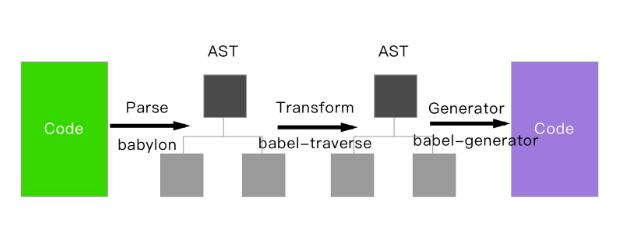

## 1. Babel 的原理是什么

#### babel 的转译过程也分为三个阶段，这三步具体是

1. 解析 : 将代码解析生成抽象语法树( 即 AST )，即词法分析与语法分析的过程
2. 转换 Transform: 对于 AST 进行变换一系列的操作，babel 接受得到 AST 并通过 babel-traverse 对其进行遍历，在此过程中进行添加、更新 及移除等操作
3. 生成 Generate: 将变换后的 AST 再转换为 JS 代码, 使用到的模块是 babel-generator



## 2. 如何写一个 babel 插件

- Babel 的插件模块需要你暴露一个 function，function 内返回 visitor

```js
module.export = function (babel) {
    return {
        visitor: {}
    }
}
```

## 3.你的 git 工作流是怎样的

1. master 主分支
2. develop 主开发分支，包含确定即将发布的代码
3. feature 新功能分支，一般一个新功能对应一个分支，对于功能的拆分需要比较合理，以 避免一些后面不必要的代码冲突
4. release 发布分支，发布时候用的分支，一般测试时候发现的
5. bug 在这个分支进行修复 hotfix 分支，紧急修 bug 的时候用

### 3.1 GitFlow 的优势

1. 并行开发：GitFlow 可以很方便的实现并行开发：每个新功能都会建立一个新 的 feature 分支，从而和已经完成的功能隔离开来，而且只有在新功能完成开发 的情况下，其对应的 feature
   分支才会合并到主开发分支上（也就是我们经常说 的 develop 分支）。另外，如果你正在开发某个功能，同时又有一个新的功能需 要开发，你只需要提交当前 feature 的代码，然后创建另外一个 feature 分支并完
   成新功能开发。然后再切回之前的 feature 分支即可继续完成之前功能的开发
2. 协作开发：GitFlow 还支持多人协同开发，因为每个 feature 分支上改动的代码 都只是为了让某个新的 feature 可以独立运行。同时我们也很容易知道每个人都 在干啥。
3. 发布阶段：当一个新 feature 开发完成的时候，它会被合并到 develop 分支，这 个分支主要用来暂时保存那些还没有发布的内容，所以如果需要再开发新 的 feature，我们只需要从 develop
   分支创建新分支，即可包含所有已经完成 的 feature;
4. 支持紧急修复：GitFlow 还包含了 hotfix 分支。这种类型的分支是从某个已经发 布的 tag 上创建出来并做一个紧急的修复，而且这个紧急修复只影响这个已经 发布的 tag，而不会影响到你正在开发的新 feature

### 3.2 rebase 与 merge 的区别

1. rebase 和 git merge 一样都是用于从一个分支获取并且合并到当前分支;

#### merge

1. marge 特点：自动创建一个新的 commit 如果合并的时候遇到冲突，仅需 要修改后重新 commit
2. 优点：记录了真实的 commit 情况，包括每个分支的详情
3. 缺点：因为每次 merge 会自动产生一个 merge commit，所以在使用一些 git 的 GUI tools，特别是 commit 比较频繁时，看到分支很杂乱

#### rebase

- rebase 特点：会合并之前的 commit 历史
- 优点：得到更简洁的项目历史，去掉了 merge commit
- 缺点：如果合并出现代码问题不容易定位，因为 re-write 了 history

## 4. VUE框架

### 4.1 说说你对 Vue 的理解

- Vue 是一个构建**数据驱动的渐进性框架**，它的目标是通过 API 实现响应数据绑定和视图更新

### 4.2 Vue 的优缺点

#### 4.2.1 Vue优点

1. 数据驱动视图，对真实 dom 进行抽象出 virtual dom并配合 diff 算法、响应式和观察者、异步队列等手段以最小代价更新 dom，渲染 页面;
2. 组件化，组件用单文件的形式进行代码的组织编写
3. **强大且丰富的 API** 提供一系列的 api 能满足业务开发中各类需求
4. 由于采用虚拟 dom，让 Vue ssr具备了天然的条件
5. 生态好，社区活跃

#### 4.2.2 缺点(Vue2.x版本)

1. 由于底层基于 Object.defineProperty 实现响应式，而这个 api 本身不支持 IE8 及以下浏览器
2. csr 的先天不足，首屏性能问题（白屏）
3. 由于百度等搜索引擎爬虫无法爬取 js 中的内容，故 spa 先天就对 seo 优化心 有余力不足

### 4.3 Vue 和 React 有什么不同？使用场景分别是什么？

1. Vue 是完整一套由官方维护的框架，核心库主要有由尤雨溪大神独自维护; React是由facebook来维护
2. Vue 上手简单，进阶式框架; React上手难度相对较大;
3. 语法上 Vue 并不限制你必须 es6+完全 js 形式编写页面，可以视图和 js 逻辑尽可能分离; react不行
4. Vue 在国内人气明显胜过 React，这很大程度上得益于它的很多语法包括编程思维更 符合国人思想

### 4.4 什么是虚拟 DOM

- 虚拟 dom是一种js对象
- 在 react，vue 等技术出现之前， 我们要改变页面展示的内容只能通过遍历查询 dom 树的方式找到需要修改的 dom 然 后修改样式行为或者结构，来达到更新 ui 的目的; 这种方式相当消耗计算资源，因为每次查询 dom
  几乎都需要遍历整颗 dom 树，如果 建立一个与 dom 树对应的虚拟 dom 对象（ js 对象），以对象嵌套的方式来表示 dom 树，那么每次 dom 的更改就变成了 js 对象的属性的更改，这样一来就能查找 js 对象
  的属性变化要比查询 dom 树的性能开销小

### 4.5 请描述下 vue 的生命周期是什么

- 生命周期就是 vue 从开始创建到销毁的过程
- 四大步:
    1. 创建, 挂载. 更新, 销毁
- beforeCreate前，也就是 new Vue 的时候会初始化事件和生命周期
- beforeCreate 和 created 之间会挂载 Data，绑定事件；接下来会根据 el 挂载页面元素，如 果没有设置 el 则生命周期结束，直到手动挂载；el 挂载结束后，根据 template/outerHTML(el)
  渲染页面；在 beforeMount 前虚拟 DOM 已经创建完 成；之后在 mounted 前，将 vm.$el 替换掉页面元素 el;mounted 将虚拟 dom 挂载到真实页面（此时页面已经全部渲染完成）；之后发生数据变化时
  触发 beforeUpdate 和 updated 进行一些操作；最后主动调用销毁函数或者 组件自动销毁时 beforeDestroy，手动撤销监听事件，计时器等；destroyed 时仅存在 Dom
  节点，其他所有东西已自动销毁。这就是我所理解的 vue 的一个完整的生命周期。

### 4.6 vue 如何监听键盘事件

1. @keyup. 方法

```vue

<template>
  <input ref="myInput" type="text" value="hello world" autofocus @keyup.enter="handleKey">
</template>
<script> export default {
  methods: {
    handleKey(e) {
      console.log(e)
    }
  }
}
</script>
```

2. addEventListener

```vue

<script>
export default {
  mounted() {
    document.addEventListener('keyup', this.handleKey)
  },
  beforeDestroy() {
    document.removeEventListener('keyup', this.handleKey)
  },
  methods: {
    handleKey(e) {
      console.log(e)
    }
  }
} </script>
```

### 4.7 watch 怎么深度监听对象变化

> deep 设置为 true 就可以监听到对象的变化

```js
let vm = new Vue({
    el: "#first",
    data: {
        msg:
            {name: '北京'}
    },
    watch: {
        msg: {
            handler(newMsg, oldMsg) {
                console.log(newMsg);
            },
            immediate: true,
            deep: true
        }
    }
})
```

### 4.8 删除数组用 delete 和 Vue.delete 有什么区别

1. delete：只是被删除数组成员变为 empty / undefined，其他元素键值不变
2. Vue.delete：直接删了数组成员，并改变了数组的键值（对象是响应式的，确保 删除能触发更新视图，这个方法主要用于避开 Vue 不能检测到属性被删除的限 制）

### 4.9 watch 和计算属性有什么区别

- 通俗来讲，既能用 computed 实现又可以用 watch 监听来实现的功能，推荐用 computed， 重点在于 computed 的缓存功能;
- computed 计算属性是用来声明式的描述一个值依赖了其它的值，当所依赖的值或者变量 改变时，计算属性也会跟着改变
- watch 监听的是已经在 data 中定义的变量，当该变量变化时，会触发 watch 中的方法

### 4.10 Vue 双向绑定原理

- Vue 数据双向绑定是通过数据劫持结合发布者-订阅者模式的方式来实现的。利用了 Object.defineProperty() 这个方法重新定义了对象获取属性值(get)和设置属性值(set)。

### 4.11 v-model 是什么？有什么用呢

- 一则语法糖，相当于 v-bind:value="xxx" 和 @input，意思是绑定了一个 value 属性的值， 子组件可对 value 属性监听，通过$emit('input', xxx)的方式给父组件通讯。自己实现
  v-model 方式的组件也是这样的思路。

### 4.12 axios 是什么？怎样使用它？怎么解决跨域的问题

1. axios 的是一种异步请求库，用法和 ajax 类似
2. 解决跨域可以在请求头中添加 `Access-Control-Allow-Origin`，也可以在 index.js 文件中更改 proxyTable 配置等解决跨域 问题

### 4.13 在 vue 项目中如何引入第三方库（比如 jQuery）？有哪些方法可以做到？

1. 绝对路径直接引入(在 index.html 中用 script 引入)
    ```html
    <script src="./static/jquery-1.12.4.js"></script>
    ```
   然后在 webpack 中配置 external
    ```js
        externals: { jquery:'jQuery' }
    ```
   在组件中使用时 import
    ```js
        import $ from 'jquery'
    ```

2. 在 webpack 中配置 alias

```js
resolve:{
    extensions:['.js', '.vue', '.json']
    alias:{
        '@'
    :
        resolve('src')
        'jquery'
    }
}
```

3. 在 webpack 中配置 plugins

```js
plugins: [new webpack.ProvidePlugin({$: 'jquery'})]
```

### 4.14 说说 Vue React angularjs jquery 的区别

1. JQuery 与另外几者最大的区别是，JQuery 是事件驱动，其他两者是数据驱动
2. JQuery 业务逻辑和 UI 更改该混在一起， UI 里面还参杂这交互逻辑，让本来混乱的逻 辑更加混乱。
3. Angular，Vue 是双向绑定，而 React 不是

### 4.15 Vue3.0 里为什么要用 Proxy API 替代 defineProperty API

1. defineProperty API 的局限性最大原因是它只能针对单例属性做监听
2. Proxy API 的监听是针对一个对象的，那么对这个对象的所有操作会进入监听操作，这 就完全可以代理所有属性，将会带来很大的性能提升和更优的代码
3. Vue.js 3.0 中，使用 Proxy API 并不能监听到对象内部深层次的属性变化，因此它的 处理方式是在 getter 中去递归响应式，这样的好处是真正访问到的内部属性才会变成响
   应式，简单的可以说是按需实现响应式，减少性能消耗

### 4.16 Vue3.0 编译做了哪些优化

1. 生成 Block tree; 在 2.0 里，渲染效率的快慢与组件大小成正相关：组件越大，渲染 效率越慢。并且，对于一些静态节点，又无数据更新，这些遍历都是性能浪费;
2. Block tree 是一个将模版基于动态节点指令切割的嵌套区块，每个 区块内部的节点结构是固定的， 每个区块只需要追踪自身包含的动态节点。所以，在 3.0 里，渲染效率不再与模板大小 成正相关，而是与模板中动态节点的数量成正相关;
3. slot 编译优化:
    - vue.js 3.0 优化了 slot 的生成，使得非动态 slot 中属性的更新只会触发子组件的更新。 动态 slot 指的是在 slot 上面使用 v-if，v-for，动态 slot 名字等会导致 slot 产生运行时动
      态变化但是又无法被子组件 track 的操作;

4. diff 算法优化
    - Vue2.x 中的虚拟 dom 是进行全量的对比
    - Vue3.0 中新增了静态标记（PatchFlag）：在与上次虚拟结点进行对比的时候，值对比 带有 patch flag 的节点，并且可以通过 flag 的信息得知当前节点要对比的具体内容化。

## 5. React

### 5.1 redux 中间件

- 中间件提供第三方插件的模式，自定义拦截 action -> reducer 的过程。变为 action -> middlewares -> reducer
- 这种机制可以让我们改变数据流，实现如异步 action ，action 过 滤，日志输出，异常报告等功能
- 常见的中间件：redux-logger：提供日志输出；redux-thunk：处理异步操作；redux-promise： 处理异步操作；actionCreator 的返回值是 promise

### 5.2 redux 有什么缺点

1. 一个组件所需要的数据，必须由父组件传过来
2. 当一个组件相关数据更新时，即使父组件不需要用到这个组件，父组件还是会重新 render，

### 5.3 React的diff 算法

1. 把树形结构按照层级分解，只比较同级元素
2. 给列表结构的每个单元添加唯一的 key 属性，方便比较
3. React 只会匹配相同 class 的 component（这里面的 class 指的是组件的名字）
4. 合并操作，调用 component 的 setState 方法的时候, React 将其标记为 dirty.到每一个 事件循环结束, React 检查所有标记 dirty 的 component 重新绘制;
5. 选择性子树渲染。开发人员可以重写 shouldComponentUpdate 提高 diff 的性能

### 5.4 了解 shouldComponentUpdate 吗

- React 虚拟 dom 技术要求不断的将 dom 和虚拟 dom 进行 diff 比较，如果 dom 树比价大， 这种比较操作会比较耗时
- shouldComponentUpdate可以控制组件的更新; 当不需要更新的时候,使用这个函数可以直接告诉react省去diff操作!

### 5.5 React 的工作原理

1. React 会创建一个虚拟 DOM(virtual DOM)。当一个组件中的状态改变时，React 首先会 通过 "diffing" 算法来标记虚拟 DOM 中的改变;
2. "diffing" 算法来标记虚拟 DOM 中的改变，第二步是调节(reconciliation)，会用 diff 的结果来更新 DOM

### 5.6 React 有何优点？

1. 只需查看 render 函数就会很容易知道一个组件是如何被渲染的
2. JSX 的引入，使得组件的代码更加可读，也更容易看懂组件的布局，或者组件之间是 如何互相引用的
3. 支持服务端渲染，这可以改进 SEO 和性能
4. 易于测试
5. React 只关注 View 层，所以可以和其它任何框架(如 Backbone.js, Angular.js)一起使用

### 5.7 展示组件(Presentational component)和容器组件(Container component)之间有 何不同？

1. 展示组件关心组件看起来是什么。展示专门通过 props 接受数据和回调，并且几乎不 会有自身的状态，但当展示组件拥有自身的状态时，通常也只关心 UI 状态而不是数据 的状态
2. 容器组件则更关心组件是如何运作的。容器组件会为展示组件或者其它容器组件提供 数据和行为(behavior)，它们会调用 Flux actions，并将其作为回调提供给展示组件。容器 组件经常是有状态的，因为它们是(其它组件的)数据源

### 5.8  (组件的)状态(state)和属性(props)之间有何不同？

1. State 是一种数据结构，用于组件挂载时所需数据的默认值。State 可能会随着时间的推移而发生突变，但多数时候是作为用户事件行为的结果。
2. Props(properties 的简写)则是组件的配置。props 由父组件传递给子组件，并且就子组 件而言，props 是不可变的(immutable)。组件不能改变自身的 props，但是可以把其子组件的 props 放在一起(
   统一管理)。Props 也不仅仅是数据--回调函数也可以通过 props 传递

### 5.9 在 React 中，refs 的作用是什么

1. Refs 可以用于获取一个 DOM 节点或者 React 组件的引用
2. Refs 回调是 React 所推荐的

### 5.10 当渲染一个列表时，何为 key？设置 key 的目的是什么

1. Keys 会有助于 React 识别哪些 items 改变了，被添加了或者被移除了
2. Keys 应该被赋 予数组内的元素以赋予(DOM)元素一个稳定的标识，选择一个 key 的最佳方法是使用一 个字符串，该字符串能惟一地标识一个列表项